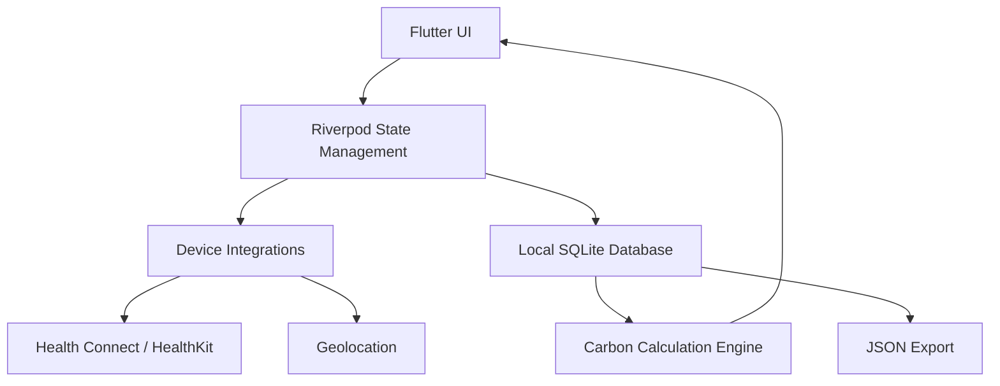
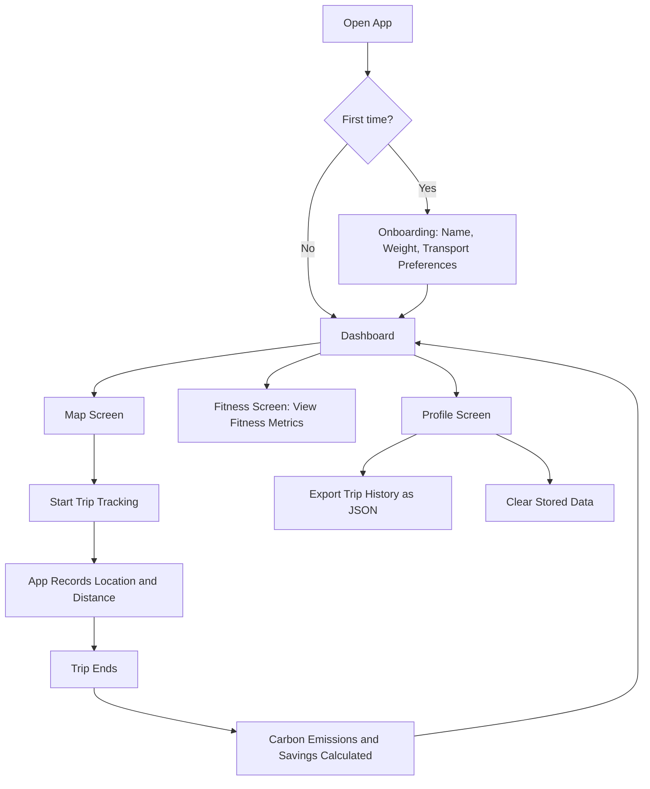
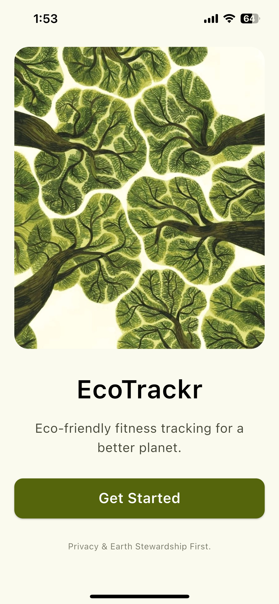
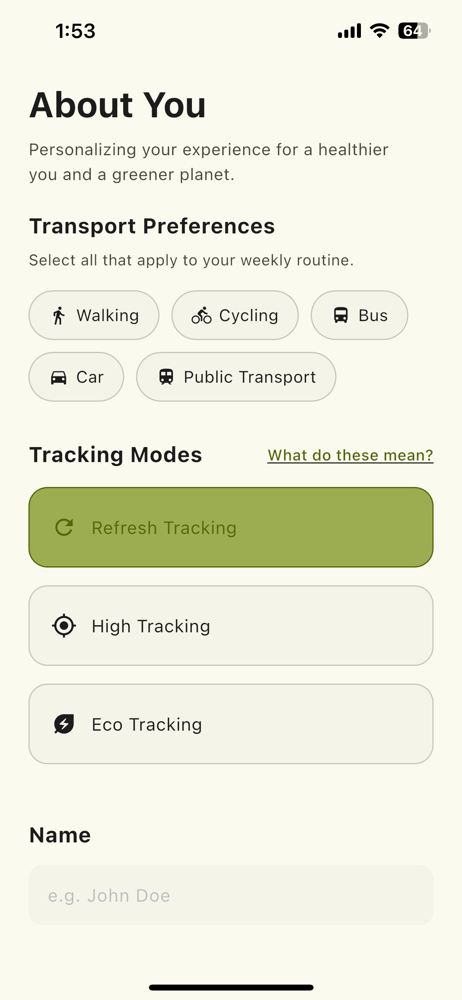
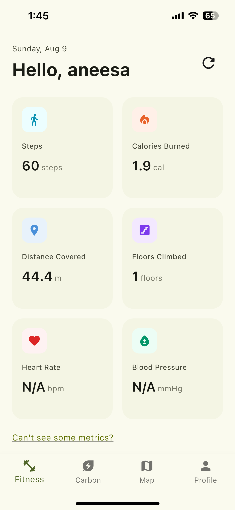
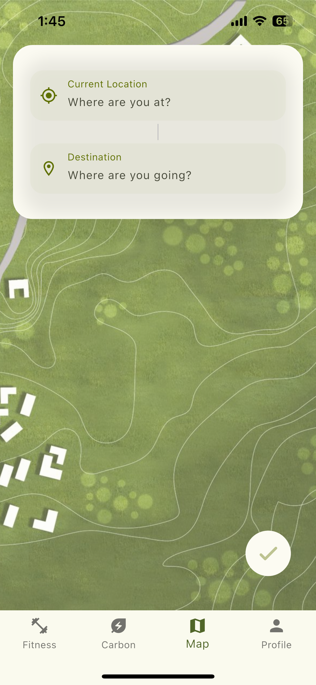
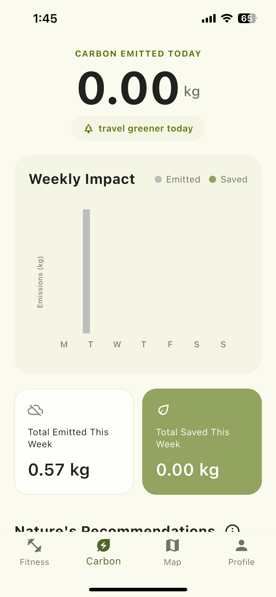
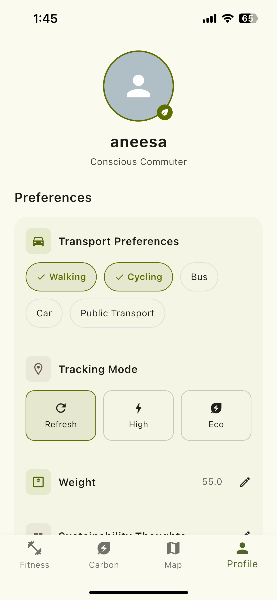

<!-- Don't delete it -->
<div name="readme-top"></div>

<!-- Organization Logo -->
<div align="center" style="display: flex; align-items: center; justify-content: center; gap: 16px;">
  
  
</div>

&nbsp;

<!-- Organization Name -->
<div align="center">

<!-- [](https://TODO.aossie.org/) -->

<!-- Correct deployed url to be added -->

</div>

<!-- Organization/Project Social Handles -->
<p align="center">
<!-- Telegram -->
<a href="https://t.me/StabilityNexus">
</a>
&nbsp;&nbsp;
<!-- X (formerly Twitter) -->
<a href="https://x.com/aossie_org">
</a>
&nbsp;&nbsp;
<!-- Discord -->
<a href="https://discord.gg/hjUhu33uAn">
</a>
&nbsp;&nbsp;
<!-- Medium -->
<a href="https://news.stability.nexus/">
  </a>
&nbsp;&nbsp;
<!-- LinkedIn -->
<a href="https://www.linkedin.com/company/aossie/">
  </a>
&nbsp;&nbsp;
<!-- Youtube -->
<a href="https://www.youtube.com/@AOSSIE-Org">
  </a>
</p>

---

<div align="center">
<h1>CarbonTracker</h1>
</div>

CarbonTracker is a Flutter-based mobile application that helps users track their fitness activity and understand its environmental impact.

The app follows a local-first and privacy-focused approach, keeping user, fitness, location, and trip data on the user's device whenever possible.

## Features

Track fitness and activity data
Track trips and transportation modes
Calculate carbon emissions and carbon savings
View fitness and environmental insights
Location-based trip tracking
Wear OS support
Export trip data as JSON
Automatic cleanup of older trip history

## 💻 Tech Stack

### Frontend
- Flutter / Dart
- SQLite (sqflite)
- Riverpod
- Health Connect / HealthKit
- Geolocation services
- Wear OS


## ✅ Project Checklist

- [ ] **The mobile app** (if applicable):
    - [ ] has an _About_ page containing the Aossie's logo and pointing to the social media accounts of the Aossie.
    - [ ] is available for download as a release in this repo.
    - [ ] is available in the relevant app stores.

## 🔗 Repository Links

1. [Main Repository](https://github.com/AOSSIE-Org/CarbonTracker.git)


## 🏗️ Architecture Diagram

TODO: Add your system architecture diagram here

```
[Architecture Diagram Placeholder]
```

## 🏗️ Architecture Diagram



## 🔄 User Flow

## 🔄 User Flow

## 🔄 User Flow



### Key User Journeys

1. **Onboarding**
    - User opens the app for the first time
    - Enters name, weight, and preferred transport modes
    - Lands on the main dashboard

2. **Logging a Trip**
    - User navigates to the Map screen
    - Starts trip tracking
    - App records location and distance in the background
    - User ends the trip
    - App calculates carbon emissions and savings
    - Results appear back on the dashboard

3. **Reviewing Fitness Metrics**
    - User navigates to the Fitness screen
    - Views fitness data such as steps, distance, and activity insights

4. **Managing Data**
    - User navigates to the Profile screen
    - Can export trip history as JSON or clear stored data at any time
5. **View Carbon Metrics**
    - Reviewing Carbon Insights
    - User navigates to the Carbon screen
    - Views daily and weekly carbon emissions and carbon savings


## 🍀 Getting Started

### Prerequisites

Before setting up CarbonTracker, make sure you have the following installed:

- Flutter
- Dart (included with Flutter)
- Android Studio or another Flutter-supported development environment
- An Android/iOS emulator or a physical device

You can verify your Flutter installation by running:

```bash
flutter doctor
```

Resolve any issues reported by `flutter doctor` before proceeding.

### Installation

#### 1. Clone the Repository

```bash
git clone https://github.com/AOSSIE-Org/CarbonTracker.git
cd CarbonTracker
```

#### 2. Install Dependencies

```bash
flutter pub get
```

#### 3. Run the App

First, check that Flutter can detect your available devices:

```bash
flutter devices
```

Then run the application with:

```bash
flutter run
```

You can run the project directly from Android Studio or another IDE with Flutter support.

## 📱 App Screenshots

|                                                         |                                                        |                                                          |
|---------------------------------------------------------|--------------------------------------------------------|----------------------------------------------------------|
|  |   |  |
|         |  |  |

---

## 🙌 Contributing

⭐ Don't forget to star this repository if you find it useful! ⭐

Thank you for considering contributing to this project! Contributions are highly appreciated and welcomed. To ensure smooth collaboration, please refer to our [Contribution Guidelines](./CONTRIBUTING.md).

## ✨ Maintainers

- [Aneesa Fatima](https://github.com/aneesafatima)

## 📍 License

This project is licensed under the GNU General Public License v3.0.
See the [LICENSE](LICENSE) file for details.

---

## 💪 Thanks To All Contributors

Thanks a lot for spending your time helping CarbonTracker grow. Keep rocking 🥂

[](https://github.com/AOSSIE-Org/TODO/graphs/contributors)

© 2026 AOSSIE
